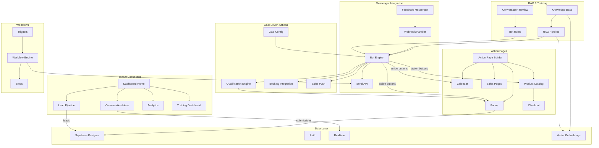
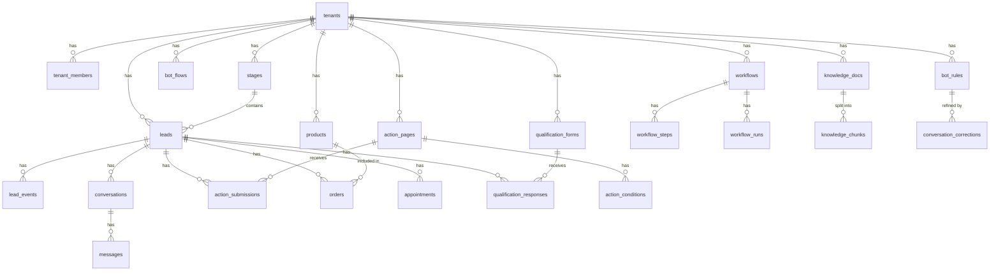

# MOC Templates Reference

These are the 4 Map of Content (MOC) index file templates used by `obsidian-bootstrap` (initial generation) and `feature-doc` (append new entries). Each template block shows the exact content to write into the corresponding file in `whatstage_obsidian/Index/`.

---

## Template 1: System Overview

**Save location:** `whatstage_obsidian/Index/System Overview.md`

````markdown
# System Overview

High-level architecture of the WhatStage Messenger Funnel platform.



## Subsystems

| Subsystem | Features | Status |
|-----------|----------|--------|
| Messenger Integration | [[Webhook Handler]], [[Bot Engine]], [[Send API]], [[Postback Handler]], [[Echo Handler]] | 🔴 Planned |
| RAG & Training | [[Knowledge Base Ingestion]], [[RAG Pipeline]], [[Bot Rules Engine]], [[Conversation Review]], [[Training Dashboard]] | 🔴 Planned |
| Goal-Driven Actions | [[Goal Configuration]], [[Qualification Engine]], [[Booking Integration]], [[Sales Push]], [[Lead Scoring]] | 🔴 Planned |
| Tenant Dashboard | [[Dashboard Home]], [[Lead Pipeline View]], [[Conversation Inbox]], [[Analytics Dashboard]], [[Training Dashboard]] | 🔴 Planned |
| Action Pages | [[Action Page Builder]], [[Lead Forms]], [[Calendar Booking]], [[Sales Pages]], [[Product Catalog]], [[Checkout Flow]] | 🔴 Planned |
| Workflows | [[Workflow Triggers]], [[Workflow Engine]], [[Workflow Steps]], [[Workflow Runs Log]] | 🔴 Planned |
| Data Layer | [[Supabase Schema]], [[Auth System]], [[Realtime Subscriptions]], [[Vector Embeddings Store]] | 🔴 Planned |
| Multi-Tenancy | [[Tenant Provisioning]], [[Subdomain Routing]], [[Tenant Isolation]], [[Onboarding Flow]] | 🔴 Planned |
| Lead Management | [[Lead Capture]], [[Stage Management]], [[Lead Events Log]], [[Lead Activity Feed]] | 🔴 Planned |
````

---

## Template 2: Database Schema Map

**Save location:** `whatstage_obsidian/Index/Database Schema Map.md`

````markdown
# Database Schema Map

Complete entity-relationship overview of all 23 Supabase Postgres tables.



## Tables by Subsystem

### Multi-Tenancy
- [[tenants]] — root tenant record; stores slug, name, FB page config, subscription plan
- [[tenant_members]] — users belonging to a tenant; role-based access (owner, admin, member)

### Lead Management
- [[leads]] — FB Messenger user profiles scoped to a tenant; tracks current stage
- [[stages]] — pipeline stages per tenant (e.g. New, Qualified, Booked, Purchased)
- [[lead_events]] — audit log of all lead actions (form fill, booking, purchase, message sent)

### Messenger Integration
- [[conversations]] — Messenger conversation thread per lead
- [[messages]] — individual messages in a conversation; direction (inbound/outbound), type

### Action Pages
- [[action_pages]] — configurable web pages launched from Messenger (form, calendar, sales, product)
- [[action_submissions]] — recorded submissions from action pages, linked to lead
- [[action_conditions]] — conditional logic rules attached to action pages

### E-Commerce
- [[products]] — product catalog entries per tenant
- [[orders]] — purchase orders placed by leads via checkout flow
- [[appointments]] — calendar bookings made by leads via booking integration

### Bot Configuration
- [[bot_flows]] — bot flow definitions per tenant (goal, buttons, message sequences)

### Workflows
- [[workflows]] — automation workflow definitions (trigger type, active flag)
- [[workflow_steps]] — ordered steps within a workflow (action type, config payload)
- [[workflow_runs]] — execution log of workflow instances triggered per lead

### RAG & Training
- [[knowledge_docs]] — uploaded knowledge documents for RAG (title, source, content)
- [[knowledge_chunks]] — vector-ready text chunks derived from knowledge_docs
- [[bot_rules]] — curated rules derived from training/corrections fed into the bot
- [[conversation_corrections]] — human corrections on bot replies used to refine bot_rules

### Qualification
- [[qualification_forms]] — form definitions used for lead qualification
- [[qualification_responses]] — submitted responses from leads to qualification forms
````

---

## Template 3: Feature Roadmap

**Save location:** `whatstage_obsidian/Index/Feature Roadmap.md`

````markdown
# Feature Roadmap

Tracks all platform features, their subsystem, current status, related data entities, and components.

## Status Legend

| Symbol | Meaning |
|--------|---------|
| 🔴 | Planned |
| 🟡 | In Progress |
| 🟢 | Complete |

## Features

| Feature | Subsystem | Status | Entities | Components |
|---------|-----------|--------|----------|------------|
| [[Webhook Handler]] | Messenger Integration | 🔴 | [[conversations]], [[messages]] | [[FbWebhookRoute]] |
| [[Bot Engine]] | Messenger Integration | 🔴 | [[bot_flows]], [[leads]], [[messages]] | [[FbWebhookRoute]] |
| [[Send API]] | Messenger Integration | 🔴 | [[messages]] | [[FbWebhookRoute]] |
| [[Postback Handler]] | Messenger Integration | 🔴 | [[leads]], [[lead_events]] | [[FbWebhookRoute]] |
| [[Echo Handler]] | Messenger Integration | 🔴 | [[messages]] | [[FbWebhookRoute]] |
| [[Knowledge Base Ingestion]] | RAG & Training | 🔴 | [[knowledge_docs]], [[knowledge_chunks]] | [[TrainingDashboard]] |
| [[RAG Pipeline]] | RAG & Training | 🔴 | [[knowledge_chunks]] | [[TrainingDashboard]] |
| [[Bot Rules Engine]] | RAG & Training | 🔴 | [[bot_rules]] | [[TrainingDashboard]] |
| [[Conversation Review]] | RAG & Training | 🔴 | [[conversation_corrections]], [[bot_rules]] | [[ConversationInbox]] |
| [[Training Dashboard]] | RAG & Training | 🔴 | [[knowledge_docs]], [[bot_rules]] | [[TrainingDashboard]] |
| [[Goal Configuration]] | Goal-Driven Actions | 🔴 | [[bot_flows]] | [[BotPage]] |
| [[Qualification Engine]] | Goal-Driven Actions | 🔴 | [[qualification_forms]], [[qualification_responses]], [[leads]] | [[ActionsPage]] |
| [[Booking Integration]] | Goal-Driven Actions | 🔴 | [[appointments]], [[leads]] | [[ActionSlugPage]] |
| [[Sales Push]] | Goal-Driven Actions | 🔴 | [[leads]], [[lead_events]] | [[BotPage]] |
| [[Lead Scoring]] | Goal-Driven Actions | 🔴 | [[leads]], [[lead_events]] | [[LeadsPage]] |
| [[Dashboard Home]] | Tenant Dashboard | 🔴 | [[tenants]] | [[BotPage]] |
| [[Lead Pipeline View]] | Tenant Dashboard | 🔴 | [[leads]], [[stages]] | [[LeadsPage]] |
| [[Conversation Inbox]] | Tenant Dashboard | 🔴 | [[conversations]], [[messages]] | [[ConversationInbox]] |
| [[Analytics Dashboard]] | Tenant Dashboard | 🔴 | [[lead_events]], [[leads]] | [[AnalyticsDashboard]] |
| [[Action Page Builder]] | Action Pages | 🔴 | [[action_pages]] | [[ActionsPage]] |
| [[Lead Forms]] | Action Pages | 🔴 | [[action_pages]], [[action_submissions]], [[leads]] | [[ActionSlugPage]] |
| [[Calendar Booking]] | Action Pages | 🔴 | [[action_pages]], [[appointments]] | [[ActionSlugPage]] |
| [[Sales Pages]] | Action Pages | 🔴 | [[action_pages]] | [[ActionSlugPage]] |
| [[Product Catalog]] | Action Pages | 🔴 | [[products]], [[action_pages]] | [[ActionSlugPage]] |
| [[Checkout Flow]] | Action Pages | 🔴 | [[orders]], [[products]], [[leads]] | [[ActionSlugPage]] |
| [[Workflow Triggers]] | Workflows | 🔴 | [[workflows]] | [[WorkflowsPage]] |
| [[Workflow Engine]] | Workflows | 🔴 | [[workflows]], [[workflow_steps]], [[workflow_runs]] | [[WorkflowsPage]] |
| [[Workflow Steps]] | Workflows | 🔴 | [[workflow_steps]] | [[WorkflowsPage]] |
| [[Workflow Runs Log]] | Workflows | 🔴 | [[workflow_runs]] | [[WorkflowsPage]] |
| [[Supabase Schema]] | Data Layer | 🔴 | all tables | — |
| [[Auth System]] | Data Layer | 🔴 | [[tenant_members]] | [[LoginPage]], [[SignupPage]], [[AuthCallbackRoute]] |
| [[Realtime Subscriptions]] | Data Layer | 🔴 | [[conversations]], [[messages]] | [[ConversationInbox]] |
| [[Vector Embeddings Store]] | Data Layer | 🔴 | [[knowledge_chunks]] | [[TrainingDashboard]] |
| [[Tenant Provisioning]] | Multi-Tenancy | 🔴 | [[tenants]], [[tenant_members]] | [[CreateTenantRoute]], [[OnboardingPage]] |
| [[Subdomain Routing]] | Multi-Tenancy | 🔴 | [[tenants]] | [[Middleware]] |
| [[Tenant Isolation]] | Multi-Tenancy | 🔴 | [[tenants]] | [[Middleware]] |
| [[Onboarding Flow]] | Multi-Tenancy | 🔴 | [[tenants]], [[tenant_members]] | [[OnboardingPage]] |
| [[Lead Capture]] | Lead Management | 🔴 | [[leads]], [[lead_events]] | [[FbWebhookRoute]] |
| [[Stage Management]] | Lead Management | 🔴 | [[stages]], [[leads]] | [[LeadsPage]] |
| [[Lead Events Log]] | Lead Management | 🔴 | [[lead_events]] | [[LeadsPage]] |
| [[Lead Activity Feed]] | Lead Management | 🔴 | [[lead_events]], [[leads]] | [[LeadsPage]] |

<!-- AUTO-UPDATED: New features are appended here by feature-doc skill -->
````

---

## Template 4: Component Registry

**Save location:** `whatstage_obsidian/Index/Component Registry.md`

````markdown
# Component Registry

All pages, API routes, and shared components in the WhatStage Next.js app.

## Marketing

| Component | Route | File |
|-----------|-------|------|
| [[MarketingHomePage]] | `/` | `src/app/(marketing)/page.tsx` |
| [[LoginPage]] | `/login` | `src/app/(marketing)/login/page.tsx` |
| [[SignupPage]] | `/signup` | `src/app/(marketing)/signup/page.tsx` |
| [[OnboardingPage]] | `/onboarding` | `src/app/(marketing)/onboarding/page.tsx` |

## Tenant Dashboard

| Component | Route | File |
|-----------|-------|------|
| [[BotPage]] | `/app/bot` | `src/app/(dashboard)/app/bot/page.tsx` |
| [[ActionsPage]] | `/app/actions` | `src/app/(dashboard)/app/actions/page.tsx` |
| [[LeadsPage]] | `/app/leads` | `src/app/(dashboard)/app/leads/page.tsx` |
| [[WorkflowsPage]] | `/app/workflows` | `src/app/(dashboard)/app/workflows/page.tsx` |
| [[SettingsPage]] | `/app/settings` | `src/app/(dashboard)/app/settings/page.tsx` |

## Action Pages

| Component | Route | File |
|-----------|-------|------|
| [[ActionSlugPage]] | `/a/:slug` | `src/app/(tenant)/a/[slug]/page.tsx` |

## API Routes

| Component | Route | File |
|-----------|-------|------|
| [[FbWebhookRoute]] | `/api/fb/webhook` | `src/app/api/fb/webhook/route.ts` |
| [[CreateTenantRoute]] | `/api/onboarding/create-tenant` | `src/app/api/onboarding/create-tenant/route.ts` |
| [[AuthCallbackRoute]] | `/auth/callback` | `src/app/auth/callback/route.ts` |

## Shared Components

| Component | Description |
|-----------|-------------|
| [[DashboardNav]] | Top/side navigation for the tenant dashboard |
| [[Middleware]] | Next.js middleware for subdomain routing and tenant isolation |

<!-- AUTO-UPDATED: New components appended by feature-doc skill -->
````
