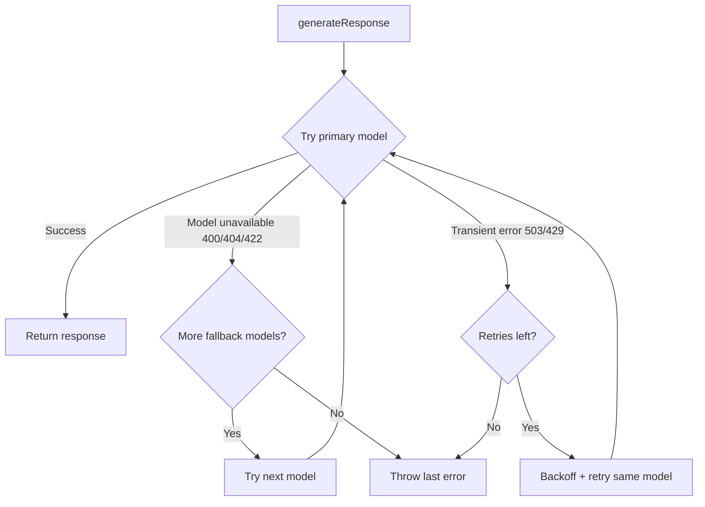

# LLM Client

The LLM client (`src/lib/ai/llm-client.ts`) handles all text generation calls to HuggingFace's inference router API.

## Architecture

## Configuration

| Constant | Value | Purpose |
|----------|-------|---------|
| `MODELS[0]` | `google/gemma-3-27b-it` | Primary model |
| `MODELS[1]` | `mistralai/Mistral-7B-Instruct-v0.3` | Fallback model |
| `FETCH_TIMEOUT_MS` | 30,000ms | Abort signal timeout |
| `MAX_RETRIES` | 2 | Per-model retry count |
| `RETRY_BACKOFF_MS` | 1,000ms | Base backoff (multiplied by attempt) |

## Known Issues & Fixes (2026-04-20)

> [!bug] "Model not supported by provider" Error (Fixed)
> The original model string `google/gemma-3-27b-it:novita` used HuggingFace's provider routing syntax to force the novita provider. Novita dropped support for this model.
>
> **Fix:** Removed `:novita` suffix (let HuggingFace auto-route) and added a fallback model array. If the primary model returns a non-retryable error (400/404/422 or "not supported"), the client automatically tries the next model.
>
> **If this breaks again:**
> - Check HuggingFace status page for provider outages
> - The model may have been deprecated — update `MODELS` array
> - If ALL models fail, the HuggingFace API key may be invalid or rate-limited

> [!warning] Retry Logic
> Only retries on **transient** errors (503 overloaded, 429 rate limit). Does NOT retry on:
> - 400 (bad request / model unavailable) — falls through to next model
> - 401 (auth) — throws immediately
> - 500 (server error) — throws immediately
>
> If you see consistent 500s from HuggingFace, consider adding 500 to the retryable set.

> [!tip] Adding New Models
> Add to the `MODELS` array in priority order. The client tries them sequentially and only falls through on model-level errors (not transient failures).

## Related Notes

- [[Bot Conversation Flow]]
- [[RAG Knowledge Retrieval Flow]]
- [[Test Chat Route]]
