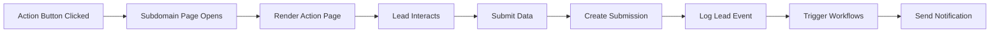

---
tags:
  - flow
subsystem: actions
created: 2026-04-18
---

# Action Page Submission Flow

## Diagram

## Steps

1. **Action Button Clicked** -- The lead clicks an action button URL in Messenger carrying their PSID.
2. **Subdomain Page Opens** -- The browser opens the tenant's subdomain, and [[Middleware]] resolves the tenant.
3. **Render Action Page** -- [[ActionSlugPage]] loads the [[action_pages]] configuration and renders the appropriate page type.
4. **Lead Interacts** -- The lead fills out a form, selects a time slot, or browses products.
5. **Submit Data** -- The lead submits their interaction data.
6. **Create Submission** -- An [[action_submissions]] record is created linking the data to the [[leads]] record.
7. **Log Lead Event** -- A [[lead_events]] entry is created (form_submit, appointment_booked, or purchase).
8. **Trigger Workflows** -- The event triggers any matching [[workflows]] via the [[Workflow Engine]].
9. **Send Notification** -- A confirmation message is sent to the lead via Messenger.

## Entities Involved

- [[action_pages]]
- [[action_submissions]]
- [[leads]]
- [[lead_events]]
- [[workflows]]

## Components Involved

- [[ActionSlugPage]]
- [[Middleware]]
