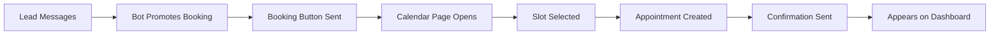

---
tags:
  - flow
subsystem: goals
created: 2026-04-18
---

# Appointment Booking Flow

## Diagram

## Steps

1. **Lead Messages** -- A lead engages in a [[conversations]] thread received by [[FbWebhookRoute]].
2. **Bot Promotes Booking** -- [[AI Reasoning]] detects booking intent and the bot pushes the calendar action button.
3. **Booking Button Sent** -- An action button URL to the [[action_pages]] calendar page is sent via [[Send API]].
4. **Calendar Page Opens** -- The lead opens [[ActionSlugPage]] and sees available time slots.
5. **Slot Selected** -- The lead selects a time slot on the calendar.
6. **Appointment Created** -- An [[appointments]] record is created and a [[lead_events]] entry is logged.
7. **Confirmation Sent** -- A confirmation message is sent back to the lead via Messenger.
8. **Appears on Dashboard** -- The appointment shows on [[LeadsPage]] for the tenant to manage.

## Entities Involved

- [[leads]]
- [[conversations]]
- [[action_pages]]
- [[appointments]]
- [[lead_events]]

## Components Involved

- [[FbWebhookRoute]]
- [[ActionSlugPage]]
- [[LeadsPage]]
