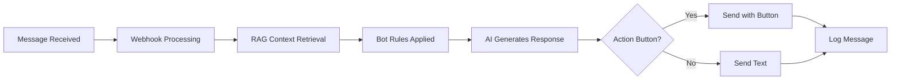

---
tags:
  - flow
subsystem: messenger
created: 2026-04-18
---

# Bot Conversation Flow

## Diagram

## Steps

1. **Message Received** -- An incoming message arrives at [[FbWebhookRoute]] from a lead.
2. **Webhook Processing** -- The message is parsed, the lead is resolved in [[leads]], and the [[conversations]] thread is updated.
3. **RAG Context Retrieval** -- Relevant [[knowledge_chunks]] are retrieved based on the message content via the [[RAG Pipeline]].
4. **Bot Rules Applied** -- [[bot_rules]] are loaded to constrain the AI's behavior and tone.
5. **AI Generates Response** -- [[AI Reasoning]] produces a response considering context, rules, and conversation history from [[messages]].
6. **Action Button Decision** -- The AI determines whether to include an action button linking to [[action_pages]].
7. **Send Response** -- The response is sent back via [[Send API]], with or without action buttons.
8. **Log Message** -- The outbound message is stored in [[messages]] and a [[lead_events]] entry is created.

## Entities Involved

- [[leads]]
- [[conversations]]
- [[messages]]
- [[knowledge_chunks]]
- [[bot_rules]]
- [[action_pages]]
- [[lead_events]]

## Components Involved

- [[FbWebhookRoute]]
- [[BotPage]]
