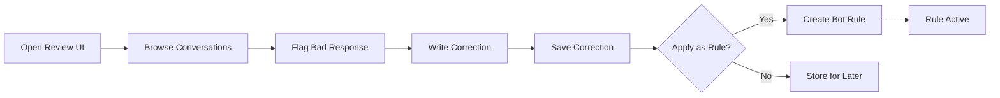

---
tags:
  - flow
subsystem: rag
created: 2026-04-18
---

# Conversation Review Flow

## Diagram

## Steps

1. **Open Review UI** -- Tenant navigates to the conversation review section on [[BotPage]].
2. **Browse Conversations** -- Tenant browses past [[conversations]] and their [[messages]].
3. **Flag Bad Response** -- Tenant identifies a bot response that was incorrect or unhelpful.
4. **Write Correction** -- Tenant writes the correct response text for the flagged message.
5. **Save Correction** -- A [[conversation_corrections]] record is created linking to the original message.
6. **Apply as Rule Decision** -- Tenant decides whether the correction should become a permanent [[bot_rules]] entry.
7. **Create Bot Rule** -- If applied, a new [[bot_rules]] record is created with source "correction".
8. **Rule Active** -- The new rule is used by [[AI Reasoning]] in future conversations.

## Entities Involved

- [[conversations]]
- [[messages]]
- [[conversation_corrections]]
- [[bot_rules]]

## Components Involved

- [[BotPage]]
