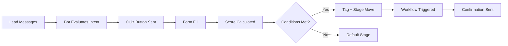

---
tags:
  - flow
subsystem: goals
created: 2026-04-18
---

# Lead Qualification Flow

## Diagram

## Steps

1. **Lead Messages** -- A lead sends a message via [[conversations]] that is received by [[FbWebhookRoute]].
2. **Bot Evaluates Intent** -- [[AI Reasoning]] analyzes the conversation context and determines the lead should be qualified.
3. **Quiz Button Sent** -- The bot sends an action button linking to the [[qualification_forms]] via [[Send API]].
4. **Form Fill** -- The lead opens the [[ActionSlugPage]] and fills out the qualification form.
5. **Score Calculated** -- [[qualification_responses]] are scored based on the form's scoring rules.
6. **Conditions Evaluated** -- [[action_conditions]] are checked against the lead's answers and score.
7. **Tag + Stage Move** -- The lead in [[leads]] is tagged and moved to the appropriate [[stages]] based on conditions.
8. **Workflow Triggered** -- A [[Workflow Engine]] automation fires based on the stage change event.
9. **Confirmation Sent** -- A confirmation message is sent back to the lead via Messenger.

## Entities Involved

- [[leads]]
- [[conversations]]
- [[qualification_forms]]
- [[qualification_responses]]
- [[action_conditions]]
- [[stages]]
- [[lead_events]]

## Components Involved

- [[FbWebhookRoute]]
- [[ActionSlugPage]]
- [[ActionsPage]]
- [[LeadsPage]]
