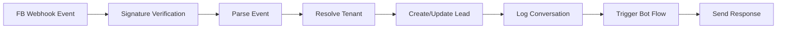

---
tags:
  - flow
subsystem: messenger
created: 2026-04-18
---

# Messenger Webhook Flow

## Diagram

## Steps

1. **FB Webhook Event** -- Facebook sends an HTTP POST to [[FbWebhookRoute]] with a messaging event.
2. **Signature Verification** -- The webhook handler validates the request signature using the tenant's fb_app_secret from [[tenants]].
3. **Parse Event** -- The event payload is parsed to extract sender PSID, message text, and postback data.
4. **Resolve Tenant** -- The tenant is resolved from the fb_page_id in [[tenants]].
5. **Create/Update Lead** -- A [[leads]] record is created or updated with the sender's PSID and Facebook profile info.
6. **Log Conversation** -- The message is logged in [[conversations]] and [[messages]], and a [[lead_events]] entry is created.
7. **Trigger Bot Flow** -- Matching [[bot_flows]] triggers are evaluated and the appropriate response is prepared.
8. **Send Response** -- The response is sent back to the lead via [[Send API]].

## Entities Involved

- [[tenants]]
- [[leads]]
- [[conversations]]
- [[messages]]
- [[lead_events]]
- [[bot_flows]]

## Components Involved

- [[FbWebhookRoute]]
