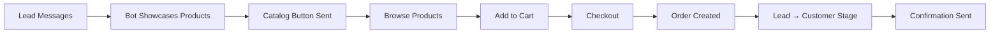

---
tags:
  - flow
subsystem: goals
created: 2026-04-18
---

# Product Purchase Flow

## Diagram

## Steps

1. **Lead Messages** -- A lead engages via [[conversations]] received by [[FbWebhookRoute]].
2. **Bot Showcases Products** -- [[AI Reasoning]] detects purchase intent and the bot highlights [[products]].
3. **Catalog Button Sent** -- An action button URL to the product catalog [[action_pages]] is sent via [[Send API]].
4. **Browse Products** -- The lead opens [[ActionSlugPage]] and browses the product catalog.
5. **Add to Cart** -- The lead selects products and adds them to their cart.
6. **Checkout** -- The lead completes checkout on the [[ActionSlugPage]] with payment reference.
7. **Order Created** -- An [[orders]] record is created and a [[lead_events]] purchase event is logged.
8. **Lead Moved to Customer** -- The lead in [[leads]] is moved to the Customer [[stages]].
9. **Confirmation Sent** -- An order confirmation message is sent back via Messenger.

## Entities Involved

- [[leads]]
- [[conversations]]
- [[products]]
- [[orders]]
- [[action_pages]]
- [[lead_events]]
- [[stages]]

## Components Involved

- [[FbWebhookRoute]]
- [[ActionSlugPage]]
- [[LeadsPage]]
