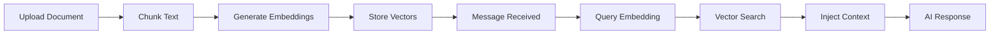

---
tags:
  - flow
subsystem: rag
created: 2026-04-18
---

# RAG Knowledge Retrieval Flow

## Diagram

## Steps

1. **Upload Document** -- Tenant uploads a document via [[BotPage]], creating a [[knowledge_docs]] record.
2. **Chunk Text** -- The document content is split into manageable [[knowledge_chunks]].
3. **Generate Embeddings** -- Each chunk is embedded using HuggingFace models to create vector representations.
4. **Store Vectors** -- The embedding vectors are stored in the [[knowledge_chunks]] embedding column.
5. **Message Received** -- A lead sends a message that arrives at [[FbWebhookRoute]].
6. **Query Embedding** -- The incoming message text is embedded into a query vector.
7. **Vector Search** -- The query vector is compared against stored [[knowledge_chunks]] to find relevant context.
8. **Inject Context** -- Retrieved chunks are injected into the AI prompt alongside [[bot_rules]].
9. **AI Response** -- [[AI Reasoning]] generates a context-aware response using the retrieved knowledge.

## Entities Involved

- [[knowledge_docs]]
- [[knowledge_chunks]]
- [[bot_rules]]
- [[messages]]

## Components Involved

- [[BotPage]]
- [[FbWebhookRoute]]
