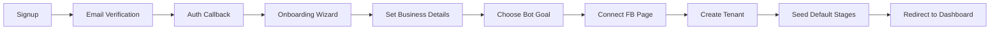

---
tags:
  - flow
subsystem: auth
created: 2026-04-18
---

# Tenant Onboarding Flow

## Diagram

## Steps

1. **Signup** -- User registers on [[SignupPage]] with email and password via Supabase Auth.
2. **Email Verification** -- Supabase sends a verification email; user clicks the confirmation link.
3. **Auth Callback** -- [[AuthCallbackRoute]] exchanges the auth code for a session.
4. **Onboarding Wizard** -- User is redirected to [[OnboardingPage]] to complete setup.
5. **Set Business Details** -- User enters slug, business name, and selects business_type for [[tenants]].
6. **Choose Bot Goal** -- User selects their bot_goal (qualify, sell, understand, collect).
7. **Connect FB Page** -- User connects their Facebook page and provides credentials.
8. **Create Tenant** -- [[CreateTenantRoute]] creates the [[tenants]] and [[tenant_members]] records.
9. **Seed Default Stages** -- Database trigger creates default [[stages]] (New Lead, Engaged, Qualified, Customer).
10. **Redirect to Dashboard** -- User is redirected to the tenant dashboard via [[TenantAppLayout]].

## Entities Involved

- [[tenants]]
- [[tenant_members]]
- [[stages]]

## Components Involved

- [[SignupPage]]
- [[AuthCallbackRoute]]
- [[OnboardingPage]]
- [[CreateTenantRoute]]
- [[TenantAppLayout]]
