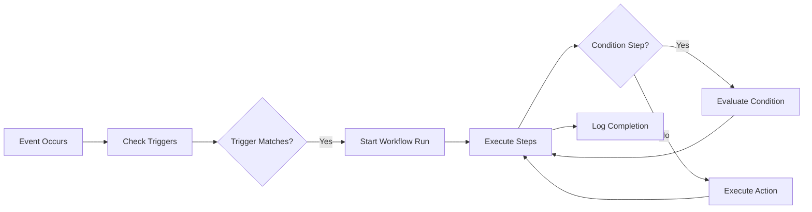

---
tags:
  - flow
subsystem: workflows
created: 2026-04-18
---

# Workflow Execution Flow

## Diagram

## Steps

1. **Event Occurs** -- A [[lead_events]] event fires (form_submit, purchase, stage_changed, appointment_booked).
2. **Check Triggers** -- The [[Workflow Engine]] evaluates all enabled [[workflows]] trigger definitions.
3. **Trigger Matches** -- If a workflow's trigger matches the event, execution begins.
4. **Start Workflow Run** -- A [[workflow_runs]] record is created with status "running".
5. **Execute Steps** -- The engine iterates through [[workflow_steps]] in order.
6. **Condition Step** -- If a step is type "condition", the engine evaluates it and branches accordingly.
7. **Execute Action** -- Action steps (send_message, move_stage, tag, etc.) are executed against the [[leads]] record.
8. **Log Completion** -- The [[workflow_runs]] record is updated with status "completed" or "failed" and the execution log.

## Entities Involved

- [[workflows]]
- [[workflow_steps]]
- [[workflow_runs]]
- [[lead_events]]
- [[leads]]

## Components Involved

- [[WorkflowsPage]]
