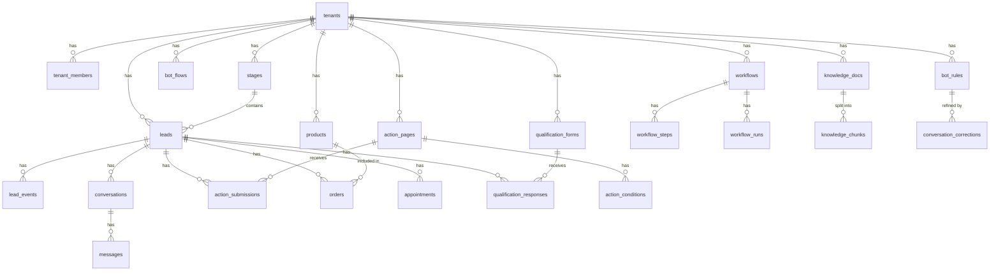

# Database Schema Map

Complete entity-relationship overview of all 23 Supabase Postgres tables.

## Tables by Subsystem

### Multi-Tenancy
- [[tenants]] -- root tenant record; stores slug, name, FB page config, subscription plan
- [[tenant_members]] -- users belonging to a tenant; role-based access (owner, admin, member)

### Lead Management
- [[leads]] -- FB Messenger user profiles scoped to a tenant; tracks current stage
- [[stages]] -- pipeline stages per tenant (e.g. New, Qualified, Booked, Purchased)
- [[lead_events]] -- audit log of all lead actions (form fill, booking, purchase, message sent)

### Messenger Integration
- [[conversations]] -- Messenger conversation thread per lead
- [[messages]] -- individual messages in a conversation; direction (inbound/outbound), type

### Action Pages
- [[action_pages]] -- configurable web pages launched from Messenger (form, calendar, sales, product)
- [[action_submissions]] -- recorded submissions from action pages, linked to lead
- [[action_conditions]] -- conditional logic rules attached to action pages

### E-Commerce
- [[products]] -- product catalog entries per tenant
- [[orders]] -- purchase orders placed by leads via checkout flow
- [[appointments]] -- calendar bookings made by leads via booking integration

### Bot Configuration
- [[bot_flows]] -- bot flow definitions per tenant (goal, buttons, message sequences)

### Workflows
- [[workflows]] -- automation workflow definitions (trigger type, active flag)
- [[workflow_steps]] -- ordered steps within a workflow (action type, config payload)
- [[workflow_runs]] -- execution log of workflow instances triggered per lead

### RAG & Training
- [[knowledge_docs]] -- uploaded knowledge documents for RAG (title, source, content)
- [[knowledge_chunks]] -- vector-ready text chunks derived from knowledge_docs
- [[bot_rules]] -- curated rules derived from training/corrections fed into the bot
- [[conversation_corrections]] -- human corrections on bot replies used to refine bot_rules

### Qualification
- [[qualification_forms]] -- form definitions used for lead qualification
- [[qualification_responses]] -- submitted responses from leads to qualification forms
