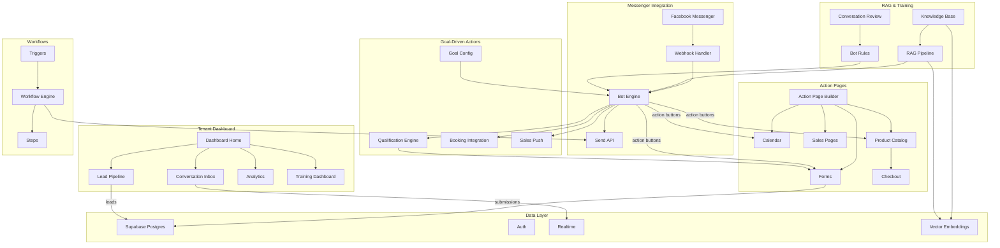

# System Overview

High-level architecture of the WhatStage Messenger Funnel platform.

## Subsystems

| Subsystem | Features | Status |
|-----------|----------|--------|
| Auth & Multi-tenancy | [[Auth Flow]], [[Tenant Routing]], [[Tenant Management]], [[Onboarding]] | Planned |
| Messenger Bot Engine | [[Webhook Handler]], [[Message Handling]], [[Send API]], [[Bot Flows]], [[AI Reasoning]] | Planned |
| Lead Management | [[Lead Pipeline]], [[Lead Profile]], [[Activity Tracking]], [[Stage Management]] | Planned |
| Action Pages | [[Form Pages]], [[Calendar Booking]], [[Sales Pages]], [[Product Catalog]], [[Checkout]], [[Action Page Builder]] | Planned |
| Commerce | [[Product Management]], [[Order Management]], [[Appointment Management]] | Planned |
| Workflows & Automation | [[Workflow Engine]], [[Workflow Builder]], [[Workflow Steps]], [[Workflow Triggers]] | Planned |
| Tenant Dashboard | [[Dashboard Home]], [[Conversation Inbox]], [[Analytics]] | Planned |
| RAG & Bot Training | [[Knowledge Base]], [[RAG Pipeline]], [[Bot Rules & Persona]], [[Test Conversation]], [[Conversation Review]], [[Training Dashboard]] | Planned |
| Goal-Driven Actions | [[Goal Configuration]], [[Qualification Engine]], [[Qualification Data View]], [[Booking Integration]], [[Sales Push]], [[Action Conditions]] | Planned |
